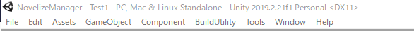

# ShellScriptGenerator使い方ドキュメント

# ShellScriptGeneratorについて

ShellScriptGeneratorはGit管理されたUnityのプロジェクトを、Jenkinsからバッチモードでビルドすることを想定したシェルスクリプト作成のツールです。

各設定ファイルはルートディレクトリ(Unityのプロジェクトフォルダの存在しているパスの1つ上の階層)に保存されます。

(例 : Projectが D:\UnityProjects\Sample\SampleProject\Assets\........ のときD:\UnityProjects\Sample に保存されます)

これは、各設定ファイルをGit管理した上で、Jenkinsのワークスペースのパスからアクセスしやすくするためです。

もし何らかの理由により、保存先を変更したい場合は適宜スクリプトを改変する必要があります。

**現在はStandaloneWindows64、StandaloneOSX、WebGLのビルドに対応しています。**

ShellScriptGeneratorとJenkinsを利用した自動ビルドの環境構築手順はこちらを参考にしてください(準備中)

# ShellScriptGeneratorの使い方

## 1. インポート

GitHubのreleaseページからUnityPackageをダウンロードし、インポートしたいUnityのプロジェクトにドラッグ&ドロップします。

UnityメニューバーにBuildUtilityの項目が追加されていればOKです。



## 2. ShellScriptGeneratorウィンドウを開く

BuildUtility>ShellScriptGeneratorの順にクリックします。


以下のウィンドウが開いていればOKです


## 3. 各パラメータの設定

### アプリケーションの名称

ビルド時に出力されるアプリケーション名を入力してください。

例えば、アプリケーションの名称をSample、PlatformをStandaloneOSXで設定した場合、アプリケーションはにSample.appとして出力されます。

### Platform

ビルドするプラットフォームを選択してください。

現在はStandaloneWindows64、StandaloneOSX、WebGLのビルドに対応しています。

### ビルドスクリプト

バッチモードで実行するスクリプトとその関数を指定します。

スクリプトをドラッグ&ドロップするとpublic static な関数を指定できるようになります。

ここで指定した関数をバッチモードで実行するようなシェルスクリプトが自動生成されるので、目的に応じて設定してください。


また、Assets\Editor\ShellScriptBuilder内にサンプルとしてCommandLineBuilder.csを用意しています。

CommandLineBuilder.cをアタッチし、呼び出す関数でBuildを選択するとSceneBuildSetting.json(後述)に登録されたSceneを自動でビルドしてくれるようになります

## シェルスクリプトを生成する。

「Generate BuildShell.sh and buildSetting.txt」ボタンを押すとルートディレクトリにBuildShell.sh と buildSetting.txt の2ファイルが生成されます。


ここで生成したBuildShell.shをJenkinsに実行させれば自動でBuildさせたりなどができるようになります。

また、生成する内容はBuildShell.shはBuildShellScript**Generator.cs**、buildSetting.txtは**BuildShellScriptSetting.cs**にそれぞれべた書きしてあるので必要があれば書き換えることも可能です。

# 4. SceneBuildSetting.jsonについて

Assets\Editor\ShellScriptBuilder内にサンプルとして配置されているCommandLineBuilder.csは、Build()実行時にScene情報を詰め込んだJsonをルートディレクトリから読み込み、ビルド対象となるSceneを収集します。

また、コマンドライン引数として「**-sceneSet {jsonのパス}**」を与えることも可能です。

Json例

```json
{
    "sceneNames": [
        "Test1",
        "Test2"
    ]
}
```

sceneNames[0]がActiveScene扱いになります。

ShellScriptGeneratorウィンドウで「Generate SceneBuildSetting.json」ボタンを押すと自動でBuildSettingに登録されているScene情報を参照して、ルートディレクトリに**SceneBuildSetting.json**を生成します。

以下の場合だと上のJson例で提示したJsonが生成されます。


